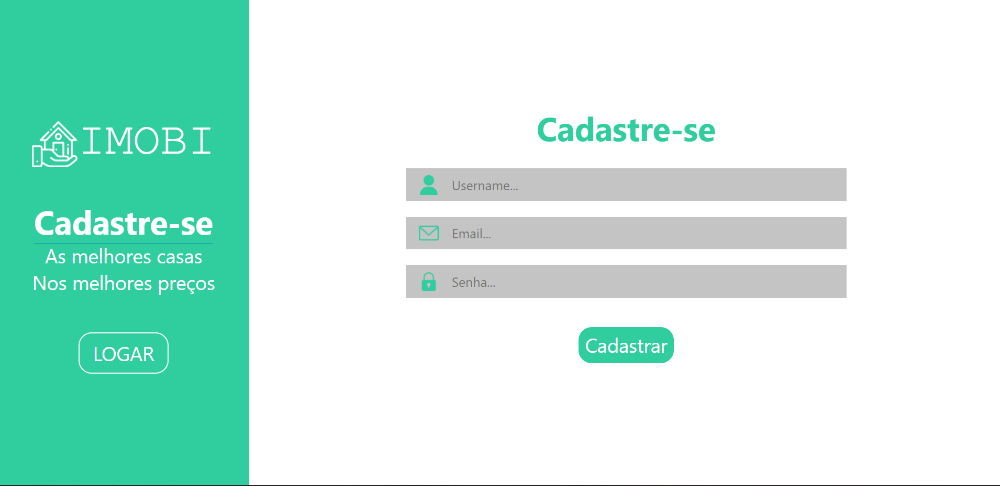
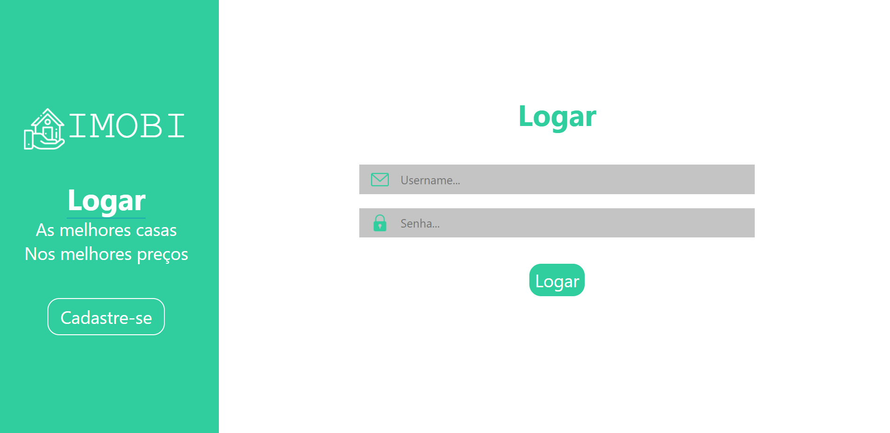
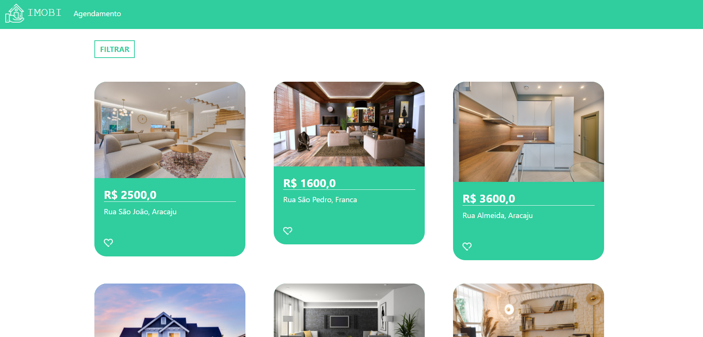
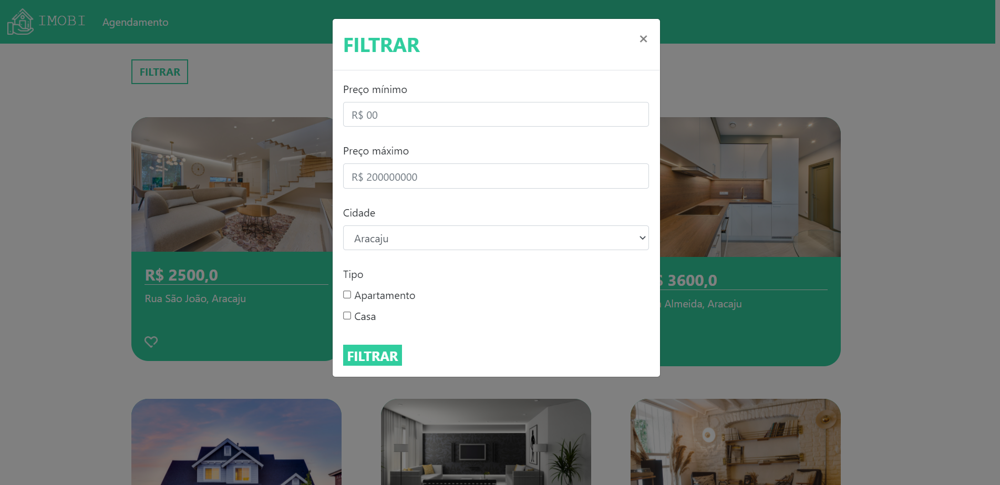
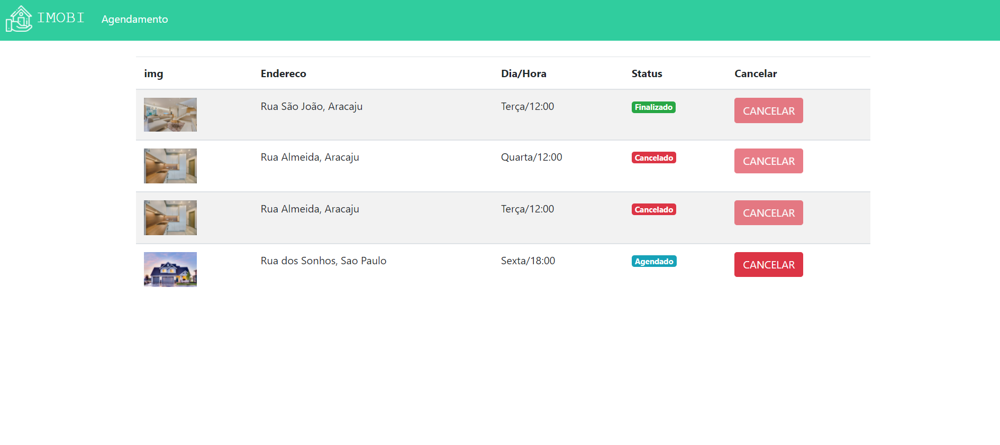

# IMOBI 

Link do projeto: https://kevin-imobi.herokuapp.com/
 
Obs: A aplicação precisa de cerca de 30 segundos para entrar em contato com o heroku.

Imobi é uma aplicação Django web construída durante a ***PyStackWeek***, evento organizado pela [Pythonando](https://www.youtube.com/c/pythonando "Site da Pythonando"). O projeto consiste em uma listagem de imóveis, onde o usário primeiramente faz seu cadastro e realiza o login no sistema, tendo acesso a página principal onde estarão disponíveis os imóveis. O usuário pode acessar a página individual de cada imóvel e ver informações como localidade, valor, descrição e imagens. Podendo agendar visitas, e gerenciá-las através da página de visitação

## Layout web

***

***

***

***

# Tecnologias utilizadas
## Back end
- Python
- Django
- SQLite
## Front end
- HTML / CSS / JS 
## Implantação em produção
- Projeto: Heroku

# Autor

Feito por: Kevin Almeida | [<a href="https://www.linkedin.com/in/kevin-almeida-desenvolvedor/">Veja meu Linkedin</a>]
 
Créditos: Pythonando | [<a href="https://www.youtube.com/c/pythonando">Veja o canal do youtube da Pythonando</a>]

# Certificado

